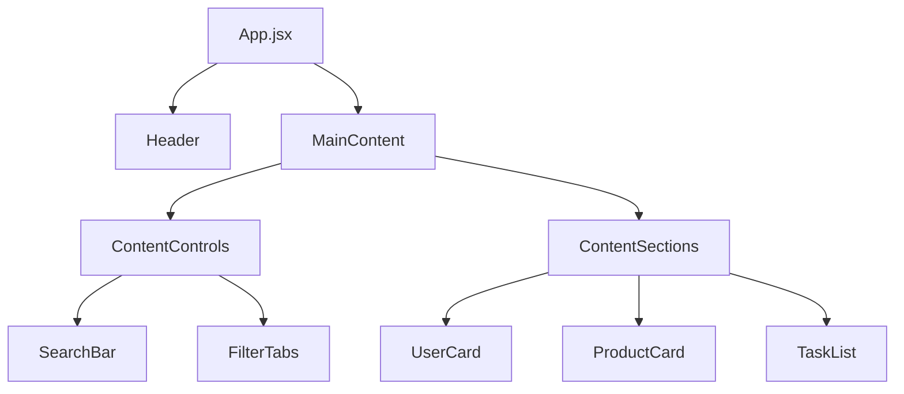

<div align="center">

# 🎯 Dashboard Management System

### A modern, responsive dashboard built with React and Tailwind CSS

[](https://frontend-pro-u.vercel.app)
[](https://reactjs.org/)
[](https://tailwindcss.com/)
[](https://vitejs.dev/)

**[🚀 View Live Demo](https://frontend-pro-u.vercel.app)** • **[📖 Documentation](#-installation)** • **[🤝 Contribute](#-contributing)**

</div>

---

## 📸 Preview

<div align="center">
  
  
  *Modern dark theme dashboard with user management, product catalog, and task tracking*
</div>

---

## ✨ Highlights

<table>
<tr>
<td width="50%">

### 🎨 **Beautiful UI**
- Sleek dark theme interface
- Smooth animations & transitions
- Responsive across all devices
- Professional color scheme

</td>
<td width="50%">

### ⚡ **High Performance**
- Optimized React components
- Efficient data filtering
- Fast load times
- Memoized calculations

</td>
</tr>
<tr>
<td width="50%">

### 🔧 **Developer Friendly**
- Clean, modular code
- Custom React hooks
- Easy to extend
- Well-documented

</td>
<td width="50%">

### 📱 **Fully Responsive**
- Mobile-first design
- Adaptive layouts
- Touch-friendly interface
- Cross-browser compatible

</td>
</tr>
</table>

---

## 🚀 Features

<details open>
<summary><b>Core Functionality</b></summary>
<br>

| Feature | Description |
|---------|-------------|
| 👥 **User Management** | View and manage team members with real-time status indicators |
| 🛍️ **Product Catalog** | Browse products with favorites and shopping cart functionality |
| ✅ **Task Tracking** | Monitor tasks with status labels and priority levels |
| 🔍 **Real-time Search** | Instant filtering across all data sections |
| 🗂️ **Tab Navigation** | Seamless switching between different data views |

</details>

<details open>
<summary><b>UI/UX Excellence</b></summary>
<br>

- 🌙 **Dark Theme** - Professional black background with optimal contrast
- 📐 **Responsive Design** - Mobile-first approach with adaptive layouts
- ⏳ **Loading States** - Elegant loading spinners and skeleton screens
- 🎭 **Interactive Elements** - Hover effects, transitions, and visual feedback
- 🎯 **Industry-Standard Header** - Professional navigation with quick stats

</details>

<details>
<summary><b>Technical Features</b></summary>
<br>

- 🧩 **Modular Architecture** - Clean component separation and reusability
- 🪝 **Custom Hooks** - Efficient data management and filtering
- ⚡ **Performance Optimized** - Memoized calculations and efficient rendering
- 📈 **Scalable Structure** - Easy to extend and maintain

</details>

---

## 🛠 Tech Stack

<div align="center">

| Technology | Purpose | Version |
|------------|---------|---------|
|  | Frontend Framework | 18+ |
|  | Styling | Latest |
|  | Build Tool | Latest |
|  | Language | ES6+ |
|  | Icons | SVG |

</div>

---

## 📦 Installation

### Prerequisites

```bash
Node.js 16+ and npm/yarn installed
```

### Quick Start

```bash
# 1️⃣ Clone the repository
git clone https://github.com/harshkumar808348/Frontend_ProU-.git
cd FRONTEND

# 2️⃣ Install dependencies
npm install

# 3️⃣ Start development server
npm run dev

# 4️⃣ Open browser at http://localhost:5173
```

### Alternative Installation

<details>
<summary>Using Yarn</summary>

```bash
yarn install
yarn dev
```
</details>

<details>
<summary>Using pnpm</summary>

```bash
pnpm install
pnpm dev
```
</details>

---

## 🏗 Project Structure

```
FRONTEND/
├── 📂 src/
│   ├── 📂 components/
│   │   ├── 📂 layout/          # Header, MainContent, Footer
│   │   ├── 📂 cards/           # UserCard, ProductCard
│   │   ├── 📂 sections/        # Content sections
│   │   ├── 📂 ui/              # Reusable UI components
│   │   └── 📂 lists/           # TaskList component
│   ├── 📂 hooks/               # Custom React hooks
│   ├── 📂 data/                # Mock data & API calls
│   └── 📄 App.jsx              # Main application component
├── 📂 public/                  # Static assets
└── 📄 package.json             # Dependencies
```

---

## 🎯 Component Architecture

### Layout Components



<table>
<tr>
<td width="33%">

#### 🎨 Layout
- **Header** - Navigation & stats
- **MainContent** - Content area
- **ContentControls** - Search & filters
- **ContentSections** - Dynamic rendering

</td>
<td width="33%">

#### 📊 Data Components
- **UserCard** - Team member info
- **ProductCard** - Product details
- **TaskList** - Task management
- **Stats** - Analytics display

</td>
<td width="33%">

#### 🔧 UI Components
- **SearchBar** - Real-time search
- **FilterTabs** - Tab navigation
- **LoadingSpinner** - Loading states
- **Button** - Action buttons

</td>
</tr>
</table>

---

## 🔧 Custom Hooks

### `useData` Hook

```javascript
const { data, loading, searchTerm, setSearchTerm, activeTab, setActiveTab } = useData();
```

**Features:**
- ✅ Mock data integration
- ✅ Real-time filtering
- ✅ Search functionality
- ✅ Loading state management
- ✅ Tab state handling

---

## 🎨 Design System

<table>
<tr>
<td>

### 🎨 Colors
```css
Background:  bg-black
Text:        text-white, text-gray-400
Primary:     blue-500, blue-600
Success:     green-500
Warning:     yellow-500
Danger:      red-500
Surface:     gray-800, gray-900
```

</td>
<td>

### 📝 Typography
```css
Headers:     font-bold, font-semibold
Body:        text-sm, text-base
Labels:      text-xs, uppercase
Hierarchy:   text-3xl → text-xs
```

</td>
</tr>
<tr>
<td>

### 📏 Spacing
```css
Container:   container mx-auto
Padding:     p-4, p-6, p-8
Margin:      mt-4, mb-6, mx-auto
Gaps:        gap-4, gap-6, gap-8
```

</td>
<td>

### 📱 Breakpoints
```css
Mobile:      < 768px   (1 column)
Tablet:      768-1024px (2 columns)
Desktop:     > 1024px  (3 columns)
Large:       > 1280px  (Full width)
```

</td>
</tr>
</table>

---

## 🚀 Performance Features

| Feature | Description | Impact |
|---------|-------------|--------|
| ⚡ **Memoized Filtering** | Efficient search operations | 🔺 Fast filtering |
| 🎯 **Optimized Re-renders** | Component-level performance | 🔺 Smooth UX |
| 📦 **Lazy Loading Ready** | Code splitting structure | 🔺 Faster loads |
| 🖼️ **Efficient Assets** | Optimized images & icons | 🔺 Quick render |

---

## 🔮 Roadmap

### 🎯 Planned Features

<details open>
<summary><b>Phase 1 - Core Improvements</b></summary>

- [ ] Backend Integration with REST API
- [ ] State Management (Redux/Zustand)
- [ ] TypeScript Migration
- [ ] Unit & Integration Testing
- [ ] Theme Toggle (Light/Dark)

</details>

<details>
<summary><b>Phase 2 - Advanced Features</b></summary>

- [ ] Pagination for Large Datasets
- [ ] Advanced Multi-criteria Filters
- [ ] Data Visualization (Charts)
- [ ] Real-time Updates (WebSocket)
- [ ] Export to CSV/PDF

</details>

<details>
<summary><b>Phase 3 - Enterprise Ready</b></summary>

- [ ] Drag & Drop Task Reorganization
- [ ] Keyboard Navigation & Shortcuts
- [ ] PWA Offline Support
- [ ] Internationalization (i18n)
- [ ] WCAG 2.1 AA Compliance

</details>

---

## 💡 Usage Examples

### Adding New Data Types

```javascript
// Extend your data structure in mockData.json
{
  "analytics": [
    {
      "id": 1,
      "metric": "Revenue",
      "value": "$125,000",
      "change": "+12.5%"
    }
  ]
}
```

### Custom Styling

```jsx
// All components use Tailwind for easy customization
<div className="bg-gradient-to-r from-blue-500 to-purple-600 p-6 rounded-lg shadow-xl">
  <h2 className="text-2xl font-bold text-white">Custom Card</h2>
</div>
```

### Creating New Components

```jsx
// Follow the established pattern
import React from 'react';

export default function CustomComponent({ data }) {
  return (
    <div className="bg-gray-800 p-4 rounded-lg">
      {/* Your component code */}
    </div>
  );
}
```

---

## 🤝 Contributing

We love contributions! Here's how you can help:

<table>
<tr>
<td>

### 🐛 Found a Bug?
1. Check existing issues
2. Create a new issue with details
3. Submit a PR with a fix

</td>
<td>

### 💡 Have an Idea?
1. Open a discussion
2. Get community feedback
3. Implement & submit PR

</td>
<td>

### 📖 Improve Docs?
1. Fork the repository
2. Update documentation
3. Submit a PR

</td>
</tr>
</table>

### Steps to Contribute

```bash
# 1. Fork the repository on GitHub
# 2. Clone your fork
git clone https://github.com/YOUR_USERNAME/Frontend_ProU-.git

# 3. Create a feature branch
git checkout -b feature/AmazingFeature

# 4. Make your changes and commit
git commit -m '✨ Add some AmazingFeature'

# 5. Push to your fork
git push origin feature/AmazingFeature

# 6. Open a Pull Request
```

---

## 📄 License

This project is licensed under the **MIT License** - see the [LICENSE.md](LICENSE.md) file for details.

<details>
<summary>What does this mean?</summary>

- ✅ Commercial use
- ✅ Modification
- ✅ Distribution
- ✅ Private use

</details>

---

## 🙏 Acknowledgments

<div align="center">

Special thanks to these amazing resources:

[](https://heroicons.com/)
[](https://unsplash.com/)
[](https://tailwindui.com/)

</div>

---

## 📞 Support & Contact

<div align="center">

### Need Help?

[](https://github.com/harshkumar808348/Frontend_ProU-/issues)
[](mailto:your-email@example.com)
[](#)

**Response Time:** Usually within 24-48 hours

</div>

---

<div align="center">

## 🌟 Show Your Support

If you found this project helpful, please consider giving it a ⭐️!

[](https://github.com/harshkumar808348/Frontend_ProU-)
[](https://github.com/harshkumar808348/Frontend_ProU-/fork)

---

### 🚀 Ready to Get Started?

```bash
git clone https://github.com/harshkumar808348/Frontend_ProU-.git
cd FRONTEND
npm install
npm run dev
```

**Built with ❤️ using React, Vite, and Tailwind CSS**

[](https://frontend-pro-u.vercel.app)

---

*Last Updated: November 2025*

</div>
